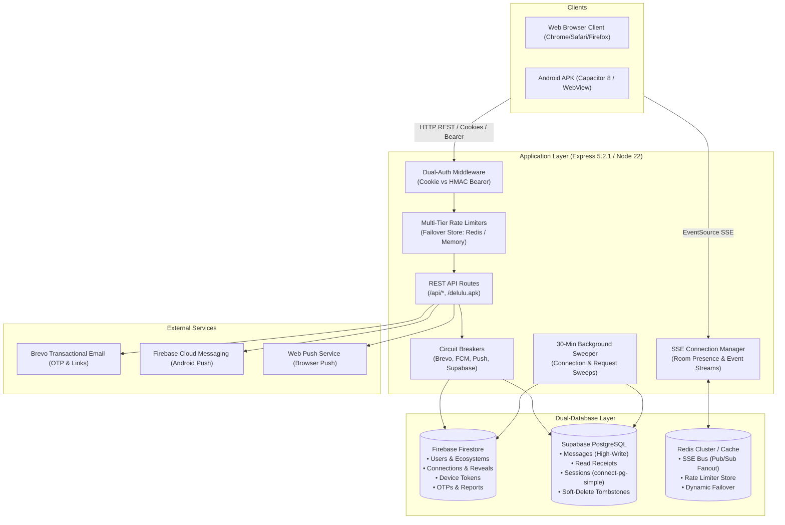

# Technical Architecture & System Design — Delulu

> **Scope**: In-depth technical specification of Delulu's dual-database partitioning, hybrid dual-auth model, Server-Sent Events (SSE) streaming pipeline, cross-instance Redis bus, state machines, and resilience engineering.

---

## 1. System Topology & Data Flow



---

## 2. Dual-Database Partitioning Architecture

Delulu partitions its persistent data across **Firebase Firestore** and **Supabase PostgreSQL** based on read/write profiles, schema flexibility, and query patterns:

| Concern | Database | Storage Engine | Rationale |
|---|---|---|---|
| **Users & Profiles** | Firestore | Document Store (`users/{id}`) | Flexible schema for avatars, hobbies array, E2EE keys, and subcollections (`devices`). |
| **Connections & Reveals** | Firestore | Document Store (`connections/{id}`) | Complex multi-stage document lifecycle (Day 7 / Day 10 state mutations, inline games). |
| **Chat Messages** | Supabase Postgres | Relational (`public.messages`) | High-write throughput, low latency indexing, sequential sorting (`created_at DESC`), soft-delete tombstones. |
| **Read Receipts** | Supabase Postgres | Relational (`public.chat_read_receipts`) | Prevents hot-document write contention in Firestore. Coalesced writes with composite primary key `(connection_id, user_id)`. |
| **Sessions** | Supabase Postgres | Relational (`public.session`) | Persistent session storage across server restarts with `connect-pg-simple`. |

---

## 3. Real-Time Pipeline: SSE + Redis Pub/Sub Cluster Fan-Out

### 3.1 Why Server-Sent Events (SSE) instead of WebSockets?
- Pure unidirectional server-to-client streaming eliminates WebSocket frame overhead and state desynchronization.
- Reconnects automatically via standard browser `EventSource`.
- Low resource consumption on Node.js EventLoop.
- Native HTTP/2 multiplexing support.

### 3.2 Real-Time Event Types

#### Connection Room Stream (`GET /api/connections/:id/stream`):
- `message`: New chat message payload (delivered instantly with zero round-trip polling).
- `read`: Read receipt timestamp update.
- `typing`: Live typing indicator (`{ userId, isTyping: true/false }`).
- `presence`: Online/offline status in the active room.
- `game`: Icebreaker mini-game created, answered, or cleared.
- `info`: System notification.
- `ended`: Chat ended via "Not Vibing", timeout, or decline.
- `face-declined`: Partner declined face reveal.
- `revealed`: Mutual face reveal complete with Google Meet code.

#### User Notification Stream (`GET /api/user/stream`):
- `message`: Incoming message preview & unread badge increment.
- `chat_ended`: Room closed event.
- `match_celebration`: Instant notification when a request is accepted.

### 3.3 Multi-Instance EventBus (`services/eventBus.js`)
On cluster or containerized deployments:
1. When a message is sent on Instance A, it emits to local listeners immediately (<1ms).
2. It publishes to Redis channel `sse:bus:connection` or `sse:bus:user`.
3. Instance B receives the event via dedicated Redis subscriber and emits to clients connected to Instance B.
4. Echo protection: Messages include `INSTANCE_ID = pid:randomHex` to discard self-echoes.
5. Zero-downtime failover: If Redis is offline, operates seamlessly in single-instance mode without throwing errors.

---

## 4. Dual Authentication Architecture

```
                  ┌─────────────────────────────────────┐
                  │           Incoming Request          │
                  └──────────────────┬──────────────────┘
                                     │
                    Has 'Authorization: Bearer <token>' ?
                                     │
                     ┌───────────────┴───────────────┐
                     │ YES                           │ NO
                     ▼                               ▼
       Validate HMAC Signature                 Read 'connect.sid'
      against Secret & Version               httpOnly Secure Cookie
                     │                               │
       ┌─────────────┴─────────────┐                 │
       ▼ Valid                     ▼ Invalid         ▼
Set req.session.userId      Return 401 Unauthorized  Set req.session
```

### 4.1 Web Cookie Authentication
- Transport: `httpOnly`, `SameSite=Lax`, `Secure` (in production).
- Storage: Cookie jar managed by browser. Zero tokens exposed to JavaScript or `localStorage` to prevent XSS credential theft.

### 4.2 Native Mobile Authentication (Capacitor Android/iOS)
- Token Structure: `"${userId}:${timestamp}:${HMAC_SHA256(userId + ':' + timestamp + ':' + token_version, SECRET)}"`
- Storage: Saved in **native `@capacitor/preferences`** (Android `SharedPreferences`).
- Lifecycle: 30-day rolling expiration.
- Instant Revocation: When user logs out or changes password, `token_version` on the Firestore user document is incremented. All previously issued tokens are rejected instantly.

### 4.3 Two-Factor Authentication (TOTP 2FA)
- Implemented via `otplib` v12 with `window: 1` drift tolerance.
- Login challenge flow: If `totp_enabled`, `POST /api/users/login` returns `{ totpRequired: true, challenge: "<hmac_signed_state>" }`.
- Challenge must be redeemed within 10 minutes via `POST /api/users/login/2fa`.
- Backup codes: 8-character single-use tokens stored as SHA-256 HMACs.

---

## 5. 10-Day Connection Lifecycle State Machine

```
   ┌─────────────┐
   │ Discover    │ ──► Send Request ──► [pending]
   └─────────────┘                          │
                                    Accept  │  Reject / Dismiss
                                            ▼       │
                                      [accepted]    └──► [rejected]
                                            │
               ┌────────────────────────────┴────────────────────────────┐
               │                                                         │
         Days 1 to 6                                                  Day 7
      Anonymous Chatting                                       Identity Reveal Button
               │                                                         │
               │                                            Mutual Agree │ Decline
               │                                                         ▼       │
               │                                                [Identities]     └──► [rejected]
               │                                                 (Username/Bio)
               │
               ▼
            Day 10 (24-Hour Face Reveal Window)
               │
      ┌────────┴────────────────────────┬────────────────────────┐
      ▼                                 ▼                        ▼
Mutual Face Reveal             Decline Face Reveal        24h Timeout
      │                                 │                        │
 status: "revealed"             status: "rejected"       status: "expired"
 Google Meet Code Generated     ended_reason:            ended_reason:
                                "face_reveal_declined"   "face_reveal_timeout"
```

---

## 6. Circuit Breaker & Fault Resilience Architecture

To prevent cascading failures when third-party or remote services experience latency spikes or downtime, all external dependencies are wrapped in **`CircuitBreaker`** instances (`utils/circuitBreaker.js`):

```javascript
class CircuitBreaker {
  // States: CLOSED (Normal), OPEN (Failing/Tripped), HALF_OPEN (Testing recovery)
  constructor(name, fn, options = { failureThreshold: 3, resetTimeout: 10000, timeout: 5000 });
}
```

### Configured Circuit Breakers:
1. `brevoBreaker`: Protects Brevo Email API (5s timeout, 3 failures, 10s cooldown).
2. `fcmBreaker`: Protects Firebase Cloud Messaging API (5s timeout, 3 failures, 10s cooldown).
3. `pushBreaker`: Protects Web Push / VAPID endpoints (4s timeout, 5 failures, 15s cooldown).
4. `supabaseBreaker`: Wraps Supabase PostgreSQL operations.

---

## 7. Multi-Tier Caching Hierarchy

```
┌─────────────────────────────────────────────────────────────┐
│                 L1: Session Cache (server.js)               │
│                 TTL: 30s | User profiles on hot auth paths   │
├─────────────────────────────────────────────────────────────┤
│             L2: Discover Feed Cache (server.js)             │
│   TTL: 10m | Scored candidate lists per viewer (Max 500)   │
├─────────────────────────────────────────────────────────────┤
│         L3: Ecosystem Candidates Cache (database.js)        │
│    TTL: 5m | All users in ecosystem (Shared across viewers) │
├─────────────────────────────────────────────────────────────┤
│          L4: Connection LRU Cache (_connCache)             │
│   TTL: 2m | Max 10,000 docs | Automatic transactional evict │
├─────────────────────────────────────────────────────────────┤
│     L5: Last-Message Cache (_lastMessageCache)             │
│  TTL: 15s | Last Supabase message preview per chat row      │
└─────────────────────────────────────────────────────────────┘
```

---

## 8. End-to-End Encryption (E2EE) Cryptographic Spec

- **Curve**: ECDH NIST P-256 (Web Crypto API `crypto.subtle`).
- **Key Generation**: On user registration.
- **Key Storage**:
  - Public Key: Base64 stored in Firestore `users/{userId}.public_key`.
  - Private Key: Encrypted client-side using AES-GCM (256-bit) with key derived from user password via PBKDF2 (100,000 iterations, SHA-256) -> stored in `users/{userId}.encrypted_private_key`.
- **Message Encryption**:
  - AES-GCM (128-bit random IV per message).
  - Ciphertext saved in `messages.content`, IV in `messages.iv`, flag `messages.is_encrypted = 1`.
  - Server treats ciphertext as opaque text. Profanity check is performed client-side prior to encryption.
